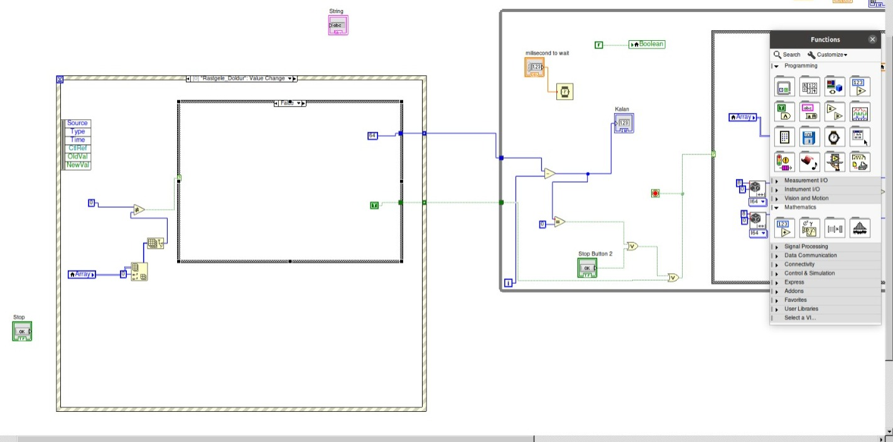
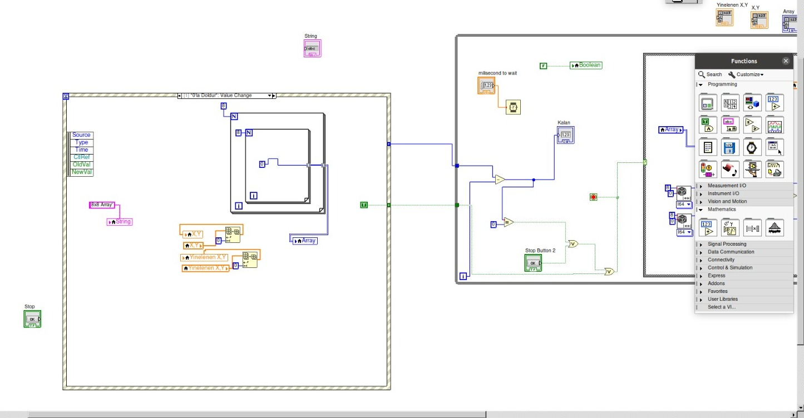
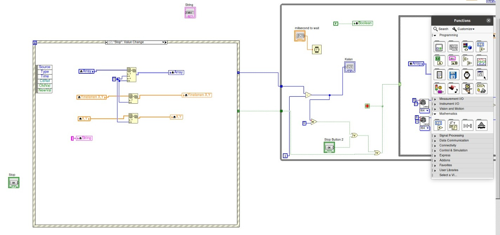
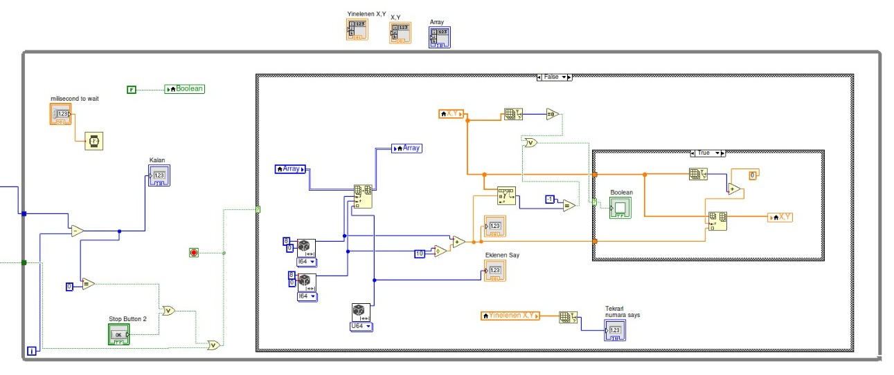
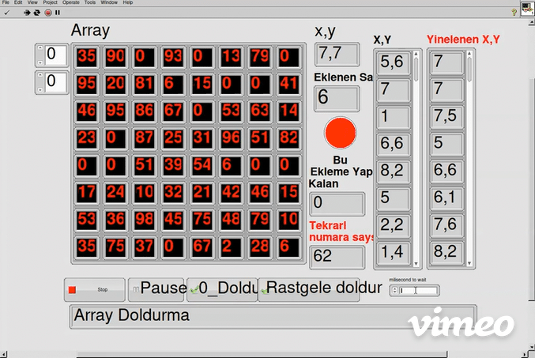
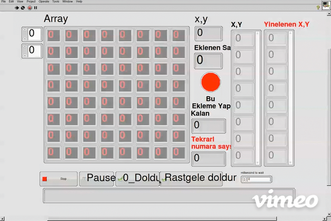
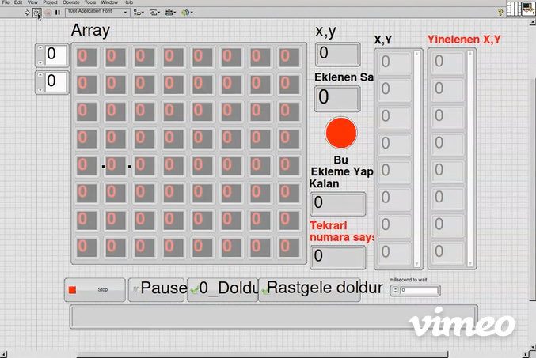
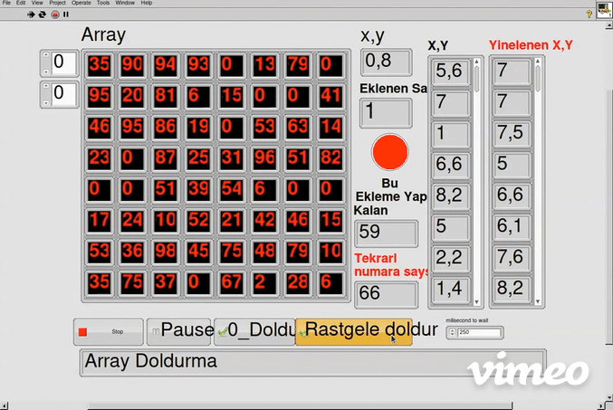

# LabVIEW-Project

## LabVIEW Nedir

LabVIEW, National Instruments tarafından geliştirilen bir programlama dilidir ve genellikle görsel programlama ortamlarıyla kullanılır. LabVIEW, bilimsel ve endüstriyel ölçümler, kontrol sistemleri, veri analizi ve görselleştirme gibi uygulamalarda sıklıkla kullanılan bir yazılım geliştirme ortamıdır.

LabVIEW'da programlar blok diyagramları olarak adlandırılan görsel şemalarda tasarlanır. Kullanıcılar, işlevsel blokların simgelerini ve bağlantılarını kullanarak programlarını oluşturabilirler. Bu, kullanıcıların karmaşık sistemleri anlamalarını ve tasarlamalarını kolaylaştırır.

LabVIEW, özellikle endüstriyel otomasyon, veri toplama, ölçüm ve kontrol uygulamalarında yaygın olarak kullanılır. Örneğin, bir mühendis bir kontrol sistemi tasarlamak veya bir laboratuvarda deneyler yapmak için LabVIEW kullanabilir. Programlamada geniş bir kullanım alanı olmasının yanı sıra, LabVIEW, cihazlar arası iletişim ve veri analizi gibi bir dizi konuda da güçlüdür.

## Proje Amacı ve Uygulama
Bu projede amacımız LabVIEW programlama dilinin temellerini anlamak ve onları uygulayabilemktir.Temel aritmerik işlemler, Temel boolean işlemler. Temel grafiksel araç arayüzü öğrenimi. , Temel dizi işlevleri. Local and global variable,Temel structre işlemleri. Temel hazır fonksiyon yapıları. gibi bir programlama dilinde kullanılan temel işlevlerin tamamı.

### Uygulama
Uygulama içeriğinde 8*8 lik bir dizi içerisine rasgele sayılar ekleme eklenen sayıları gösterme aynı indexe verileri yazılmaya çalışılırsa log tutma.Pause gibi işlevsellik gerektiren durumlar.

## Proje içerisinden resim ve jpeg

### Schema

### Uygulama Gif

